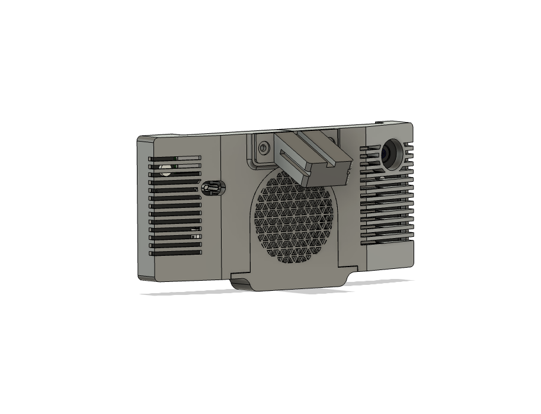

# Case for Google Pixel 3 (Openpilot)
If you have any questions contact me on Discord: loetkolben#2962

## Black Panda Version
Parts:
* 4x M3 heatinserts (5mm (Diameter) x 4mm)
* M3 screws in different length
* Heatsink (100x60x10mm)
* 60x60x10mm 5V Fan

The fan is screwed directly into the Case without heatinserts.

The Case can be also used with a batteryless mod.
Next to the USB Port is some space for two super capacitors.
For more information about the batteryless-mod, have a look at this repository: 
https://github.com/lukasloetkolben/StealthFreon

I will update this ReadMe with instructions for batteryless Pixel3 soon.

## Uno Version

Parts:
* 4x M3 heatinserts (5mm (Diameter) x 4mm)
* M3 screws in different length
* "Comma Uno Board" (available in comma.ai parts shop)
* custom heatsink

This Version does require a custom heatsink with a 12V Fan.

